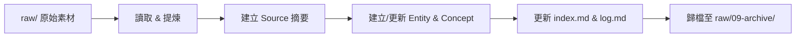

# 🧠 LLM Wiki Starter Kit - Second Brain (v2.3)

> **最新版本**: v2.3 (雙軌相容升級版 — 同步技能與清理架構)
> **v2.3 更新**: 雙軌架構對齊：同步了 Claude Code 與 Antigravity 的 Skills，清除根目錄散落的 Python 腳本並收納至 `scripts/` 中，全面優化索引與範本格式為嚴格的雙鏈 (`[[ ]]`) 格式。
> **v2.2 更新**: 升級 `/ingest` 技能，加入嚴格的防呆與正規化比對機制，攝取時自動對齊現有實體與概念，徹底解決大小寫與縮寫不一致產生的死鏈問題。
> **v2.1 更新**: 升級 `/scaffold` 安裝精靈，支援一鍵無痛部署（免互動確認），並補齊 Claude Code 路由與結構圖。
>
> 一鍵初始化符合 [Karpathy LLM Wiki 規範](https://gist.github.com/karpathy/442a6bf555914893e9891c11519de94f) 的 Obsidian 知識庫，內建 AI Agent 自動化工作流（Claude Code / Antigravity / 通用 Agent）。

---

## ✨ 這是什麼？

這是一個**開箱即用的 Obsidian Vault 初始化模板**（懶人包）。它包含：

- 📁 **完整的目錄架構**：raw（原始素材）/ wiki（知識編譯）/ assets（媒體資產）
- 📜 **AI Agent 規則檔案**：讓任何 AI Agent 理解你的知識庫結構與操作規範
- 🛠️ **三大核心 Skills**：ingest（攝取）/ query（查詢）/ lint（巡檢）
- 🔗 **雙鏈知識網絡**：自動維護 Obsidian 雙向連結，杜絕孤島頁面

### 設計哲學

```
raw/（不可變層）──→ AI Agent 編譯 ──→ wiki/（知識輸出層）
     唯讀                                  你擁有這裡
```

你只需將原始素材丟進 `raw/`，AI Agent 就會自動提煉、翻譯、建立實體與概念頁面、維護索引與日誌。

---

## 🚀 快速開始（超直覺安裝法）

> **重要觀念**：此儲存庫為「安裝包」，並非您最終使用的 Obsidian Vault 位置。
> 我們提供以下兩種極簡的部署方式，幫您快速初始化一個乾淨、無雜訊的第二大腦。

### 方法一：一鍵 Shell 腳本

您只需在終端機中執行以下指令，即可自動將所有必備的目錄與 AI 技能精準複製到您的 Obsidian Vault 中：

```bash
# 1. 克隆本儲存庫
git clone https://github.com/YOUR_USERNAME/llm-wiki-starter-kit-second-brain.git

# 2. 執行初始化腳本（指定您的 Obsidian Vault 目錄絕對路徑）
bash llm-wiki-starter-kit-second-brain/scaffold.sh ~/Documents/My-Wiki-Vault

# 3. 完成！直接以 Obsidian 開啟該目錄即可開始使用
```

### 方法二：AI 互動式精靈（AI 協助 🧠）

如果您已經在使用 AI Agent，可以直接以 Agent 開啟本安裝包目錄，並在對話框輸入：
> `/scaffold` 或 `幫我初始化知識庫`

AI Agent 將會以互動方式詢問您的 Obsidian 目錄絕對路徑，並精準完成部署，**絕不會將安裝包本身的無關檔案（如 .git、README.md）複製過去**，確保目標目錄絕對純淨。

### 方法三：複製以下Prompt，丟給Agent處理（推薦 🌟）

在您的 Obsidian Vault 目錄中開啟 AI Agent，貼上以下 Prompt 即可全自動完成安裝：

```Prompt
請依照以下步驟幫我完成安裝：
1. Clone 安裝包：
   git clone https://github.com/stubipapa/llm-wiki-starter-kit-second-brain.git
2. 執行安裝精靈，將知識庫架構安裝到「當前目錄」（即此 Vault 的根目錄，不是 clone 下來的子資料夾）：
   - 目標路徑為此 project 的根目錄
   - 請讀取 llm-wiki-starter-kit-second-brain/.claude/skills/scaffold/skill.md 中的 SOP 執行安裝
   - 無需再次詢啎路徑確認
3. 安裝完成後，刪除 clone 下來的安裝包資料夾 llm-wiki-starter-kit-second-brain/
```

---

## 🏗️ 架構原理

### 檔案載入鏈

AI Agent 不會自己知道你的知識庫規則。它靠**入口檔**引導，一步步讀取：

```
Claude Code 啟動
  └→ 自動讀取 CLAUDE.md（平台硬編碼行為）
       └→ CLAUDE.md 裡寫著「讀 WIKI_SCHEMA.md」
            └→ Agent 讀取 WIKI_SCHEMA.md，理解全部規則

Antigravity 啟動
  └→ 自動讀取 .agyrules（平台硬編碼行為）
       └→ .agyrules 裡寫著「遵守 WIKI_SCHEMA.md」
            └→ Agent 讀取 WIKI_SCHEMA.md，理解全部規則
```

### 為什麼規則放在 WIKI_SCHEMA.md 而不是入口檔？

```
CLAUDE.md ─────┐
               ├──→ WIKI_SCHEMA.md（共用規範，改一處全局生效）
.agyrules ─────┘
```

入口檔各平台不同，但規則是通用的。抽出來放 `WIKI_SCHEMA.md`，兩邊都只需一行「去讀它」。

### 初始化後的 Vault 結構

```
My-Vault/                          ← Vault 根目錄
├── CLAUDE.md                      ← Claude Code 入口（自動讀取）
├── .agyrules                      ← Antigravity 入口（自動讀取）
├── WIKI_SCHEMA.md                 ← 核心規範（被上面兩個引用）
├── .claude/skills/                ← Claude Code 的 Skills
│   ├── ingest/
│   │   ├── skill.md
│   │   └── scripts/
│   ├── lint/
│   │   ├── skill.md
│   │   └── scripts/
│   ├── query/skill.md
│   └── scaffold/skill.md
├── .agents/skills/                ← Antigravity 的 Skills
│   ├── ingest/
│   │   ├── SKILL.md
│   │   └── scripts/
│   ├── lint/
│   │   ├── SKILL.md
│   │   └── scripts/
│   ├── query/SKILL.md
│   └── scaffold/SKILL.md
├── raw/                           ← 原始素材收件箱（唯讀）
│   ├── 01-articles/
│   ├── 02-papers/
│   ├── 03-transcripts/
│   ├── 04-clipper/
│   └── 09-archive/
├── wiki/                          ← 知識編譯輸出區
│   ├── concepts/
│   ├── entities/
│   ├── sources/
│   ├── syntheses/
│   ├── index.md
│   └── log.md
└── assets/                        ← 媒體資產存放區
```

---

## 🛠️ 內建 Skills

| 指令 | 功能 | 觸發方式 |
|------|------|----------|
| `/ingest` | 將 raw/ 原始素材編譯為 wiki/ 知識頁面 | `/ingest` 或 `/ingest <路徑>` |
| `/query` | 在本地知識庫中精準檢索並回答 | `/query <問題>` |
| `/lint` | 知識庫健康度全面巡檢 | `/lint` |

### Ingest 工作流


### Lint 巡檢項目
- ✅ 索引一致性（index.md 與實體檔案同步）
- ✅ 雙鏈健康（死鏈偵測）
- ✅ 孤兒頁面偵測
- ✅ 知識衝突審查

---

## ➕ 如何新增 Skill

### 第 1 步：建立 Skill 檔案

以新增 `export` skill 為例，建立兩份（Claude Code + Antigravity）：

```bash
# Claude Code 版
mkdir -p .claude/skills/export
touch .claude/skills/export/skill.md

# Antigravity 版（內容相同，檔名不同）
mkdir -p .agents/skills/export
touch .agents/skills/export/SKILL.md
```

### 第 2 步：撰寫 Skill 內容

```markdown
---
name: export
description: 將 wiki/ 中的知識頁面匯出為 PDF 或簡報格式。當用戶提到"匯出"、"輸出報告"、"轉 PDF" 時觸發。
user-invocable: true
---

# export 技能：知識匯出

## 1. 核心目標
[描述這個 skill 要做什麼]

## 2. 觸發條件
[什麼時候該觸發]

## 3. 操作流程 (SOP)
[步驟化的執行指南]
```

> **關鍵**：`description` 寫得好不好，直接決定 AI 能不能自動找到你的 skill。
> 把所有可能的觸發詞（匯出、輸出、轉 PDF……）都寫進去。

### 第 3 步：在入口檔登記路由

編輯 `CLAUDE.md`，新增一行：
```markdown
   - `/export` -> 調用 `.claude/skills/export/skill`
```

### 第 4 步：同步到另一個平台

```bash
# 一鍵同步：從 .claude 複製到 .agents
for dir in .claude/skills/*/; do
  name=$(basename "$dir")
  mkdir -p ".agents/skills/$name"
  cp "$dir/skill.md" ".agents/skills/$name/SKILL.md"
done
```

### Skill 觸發機制總結

| 觸發方式 | 運作原理 | 你要做什麼 |
|----------|---------|-----------|
| **自動觸發** | 平台比對 `description` 與用戶意圖 | 把 `description` 寫清楚完整 |
| **斜線指令** | 用戶輸入 `/export`，Agent 查路由表 | 在 `CLAUDE.md` 登記路由 |
| **自然語言** | 用戶說「幫我匯出報告」 | 同自動觸發（靠 description） |

### Skill 存放路徑對照

| 平台 | Skill 路徑 | 檔名 |
|------|-----------|------|
| Claude Code | `.claude/skills/<名稱>/` | `skill.md` |
| Antigravity | `.agents/skills/<名稱>/` | `SKILL.md` |

兩份檔案的**內容可以 100% 一樣**，只是路徑和檔名不同。

---

## 📝 自訂指南

### 品牌與語意設定
編輯 `WIKI_SCHEMA.md` 中的 **§3.D 核心語意與品牌特例守則**：

```markdown
### D. 核心語意與品牌特例守則 (Custom Constraints)
- **品牌概念**：[填入你的品牌核心概念]
- **產品感受**：[填入你希望產出的風格與調性]
```

### 新增 raw/ 子分類
在 `raw/` 下新增你需要的分類目錄（如 `05-meetings/`、`06-bookmarks/`），並在 ingest skill 中更新說明。

### 語言設定
預設使用**台灣繁體中文 (zh-TW)**。若需變更，修改 `WIKI_SCHEMA.md` 的 §1 語言指令。

---

## 🤝 相容性

| AI Agent | 支援狀態 | 入口檔 | Skill 路徑 |
|----------|----------|--------|-----------|
| Claude Code | ✅ 完整支援 | `CLAUDE.md` | `.claude/skills/` |
| Antigravity IDE | ✅ 完整支援 | `.agyrules` | `.agents/skills/` |
| Cursor / Windsurf | ⚡ 相容 | 手動餵入 `WIKI_SCHEMA.md` | 不支援原生 Skill |
| 其他 Agent | ⚡ 相容 | 手動餵入 `WIKI_SCHEMA.md` | 不支援原生 Skill |

---

## 📜 License

MIT License — 自由使用、修改與分享。

---

## 🙏 致謝

- [Andrej Karpathy](https://gist.github.com/karpathy/442a6bf555914893e9891c11519de94f) — LLM Wiki 原始概念
- [Obsidian](https://obsidian.md/) — 本地 Markdown 知識管理
- [Anthropic](https://www.anthropic.com/) — Claude Code Skills 架構
- [Google](https://google.com/) — Antigravity IDE Agent Skills
